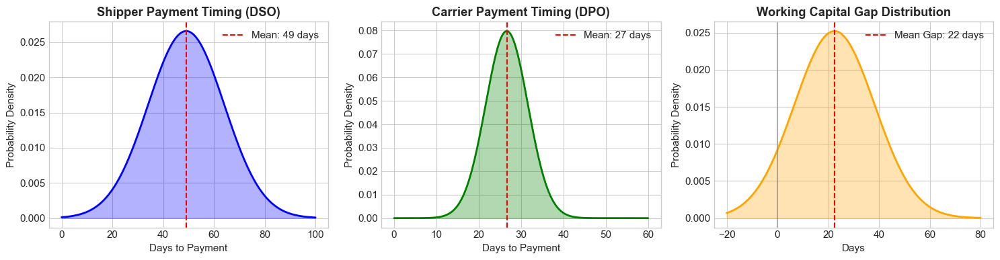
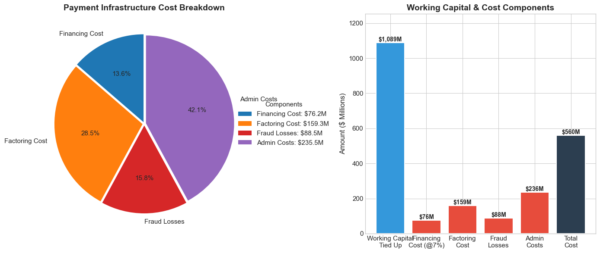
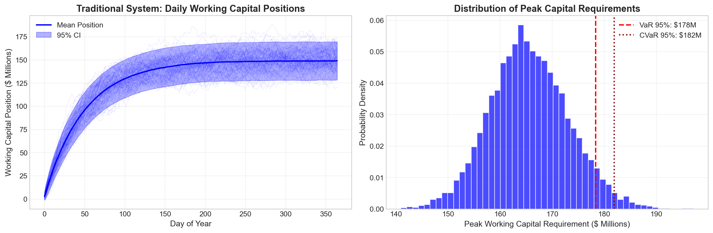
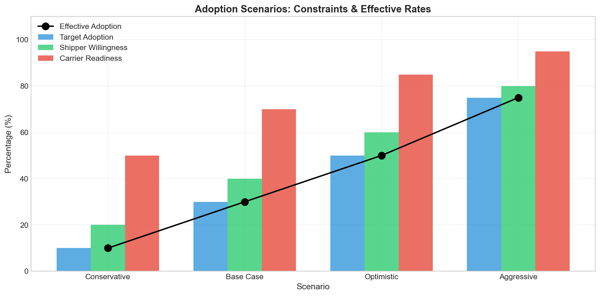
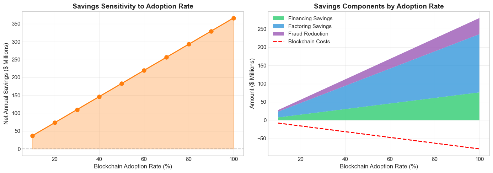
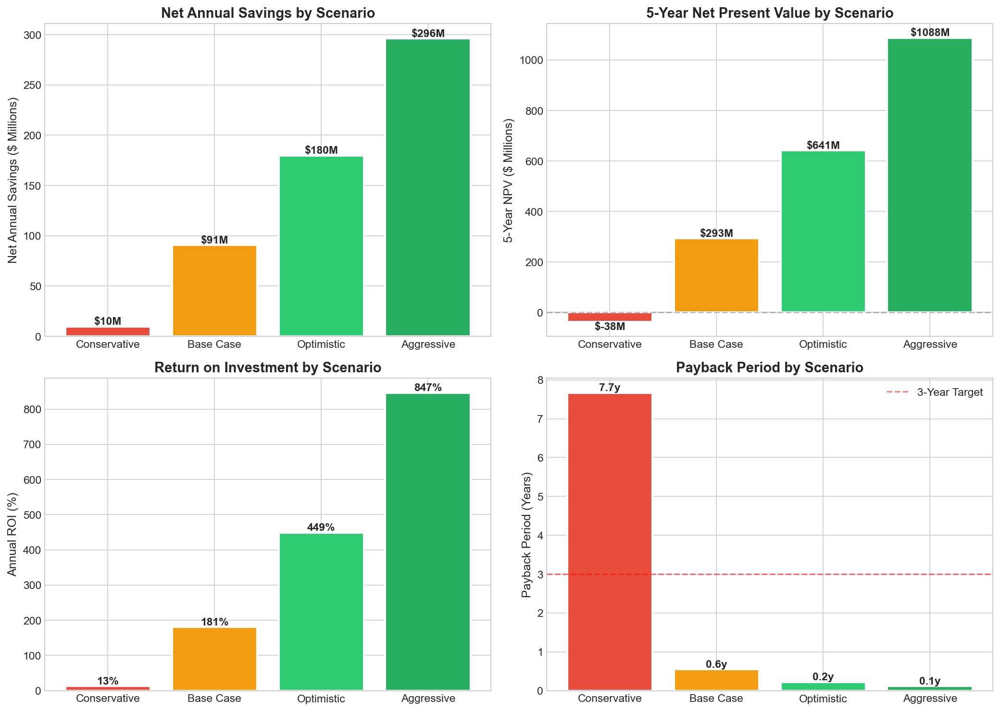
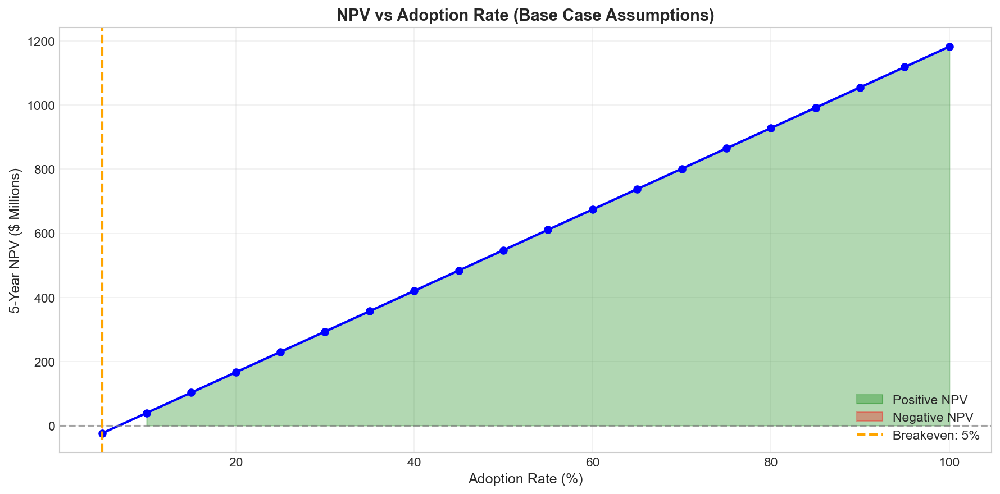
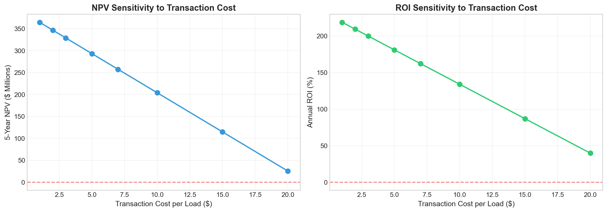
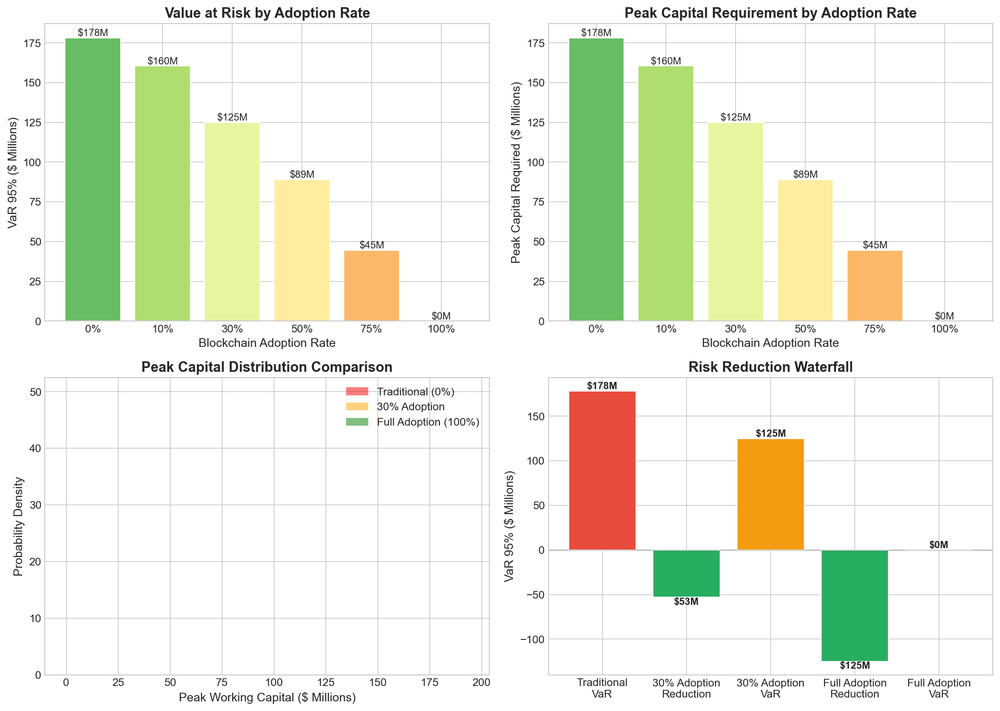

# Blockchain Payments Infrastructure for Freight Brokerage

**Raja Hussain**
February 5, 2026

Supporting code and simulation: https://github.com/Hussain0327/freight-settlement-infrastructure

---

## Business Selected

**C.H. Robinson Worldwide (NASDAQ: CHRW)** — North America's largest non-asset freight broker.

---

## Summary

Freight brokerage has a structural cash flow problem. Brokers pay carriers within 7-30 days, but shippers pay brokers on 30–90 day terms. For C.H. Robinson, this 33-day gap ties up $1.46B in working capital and costs over $100M annually in financing. The industry has also lost $10B to double-brokering fraud since 2022. The payments pain is easy to see: brokers often have to pay carriers first (or pay them fast to keep capacity), while shippers pay the broker later. There is a timing mismatch which ties up cash, creates financing cost, and makes every dispute or fraud case more painful.

My hypothesis isn't "blockchain fixes logistics." It's narrower than that: use blockchain strictly as a settlement layer, so payments move much faster, with conditions enforced automatically.

Concretely, the model is:

- Use a dollar stablecoin (or a stablecoin-backed service) for 24/7 settlement
- Use smart-contract escrow so funds are locked and only released when delivery is verified
- Keep a shared, tamper-evident audit trail so disputes are faster to resolve

If this works, the upside is straightforward: less working capital tied up, fewer manual payment exceptions, and lower loss from certain fraud/dispute patterns. The downside is also very real: adoption (carriers and shippers), compliance, and the reliability of "delivery verification" data would be the hardest parts.

---

## 1. Business & Payments Reality

### 1.1 Business Overview

C.H. Robinson operates as a global logistics platform connecting approximately 90,000 customers with 450,000 contract carriers. As a non-asset-based provider, the company does not own transportation equipment—instead, it functions as a "matchmaker" for freight. Shippers (customers) require goods moved, carriers provide the capacity, and C.H. Robinson facilitates the transaction, managing the logistics, data, and financial settlement. The company generates revenue through the spread between the rate charged to the shipper and the rate paid to the carrier.

### 1.2 Payments Flow

The current flow for C.H. Robinson operates through a five-step process:

**Step 1: Load booked** — shipper tenders a load to the broker; the broker books a carrier.

**Step 2: Delivery proof created** — after delivery, the carrier provides proof of delivery (POD). This can be paper or digital.

**Step 3: Carrier invoice + validation** — the carrier invoices; the broker checks POD, accessorials (detention, lumper, etc.), and resolves mismatches.

**Step 4: Carrier gets paid** — speed matters here. Carriers need cash for fuel, payroll, and operations. QuickPay programs exist because waiting 30 days is expensive for a company running trucks.

**Step 5: Shipper pays later** — the shipper typically pays on net 60–90 day terms. The broker bridges the gap. For C.H. Robinson, this means $1.09B in working capital tied up at any given time.

**Pain points:** (i) timing mismatch (cash tied up), (ii) manual exceptions and disputes, and (iii) identity/assignment ambiguity that fraudsters exploit.

*Figure 1: Payment timing distribution (DSO vs. DPO) illustrating the working-capital gap that brokers must finance.*

### 1.3 Key Constraints

**Economic.** C.H. Robinson's DSO runs 49 days while DPO averages 27 days. That 22-day gap ties up $1.09B in working capital and costs $76M annually to finance at 7%.

*Figure 2: Illustrative breakdown of working-capital and payments-related costs under the traditional system.*

**Operational.** Every load requires POD validation, accessorial reconciliation, and exception handling before payment releases. At 15.7 million loads per year, this drives an estimated $236M in administrative cost.

**Risk and regulatory.** 15,419 broker authorities were revoked between 2022–2025, largely for non-payment. The $75,000 FMCSA surety bond is insufficient to cover carriers when brokers fail. Double-brokering alone has drained over $10B from the industry.

*Figure 3: Working-capital risk under the traditional payment system (simulation paths and tail-risk distributions).*

### 1.4 Why Payments Matter

Payments meaningfully affect:

- **Margin:** financing cost and payment operations consume roughly 10% of C.H. Robinson's operating profit. In an industry where gross margins run 10–15%, payment friction eats a disproportionate share of earnings.
- **Growth:** working capital scales linearly with volume, setting a practical growth ceiling for undercapitalized brokers.
- **Risk:** slow settlement and weak identity verification have cost the industry over $10B in fraud and unpaid invoices since 2022.

---

## 2. Blockchain Transformation Hypothesis

### 2.1 What Changes

Replace parts of the multi-week settlement cycle with near-real-time conditional settlement:

- **Stablecoin settlement rails:** dollar-denominated settlement with faster finality and 24/7 availability.
- **Smart-contract escrow:** funds are locked at booking and released automatically when delivery conditions are verified (geofenced arrival confirmation, digital POD signature, timestamp within appointment window).
- **Shared audit trail:** a tamper-evident record of key state transitions (booking, acceptance, delivery verification, payout).

### 2.2 Why Blockchain Matters Here

The differentiating capability is **programmable, atomic settlement**: payment is executed automatically and conditionally based on verified events, reducing the need for intermediaries and shortening the cash conversion cycle.

### 2.3 Scope of Change (On-Chain vs. Off-Chain)

**On-chain (realistic near-term):**
- Escrow and settlement legs (shipper → broker and broker → carrier)
- Hashes/attestations of delivery artifacts and key timestamps (not full documents)
- Payment status and audit log for dispute reduction

**Off-chain (should remain off-chain initially):**
- Pricing/negotiation, load matching, relationship management
- Bills of lading, invoices, and rich documentation (store references/hashes only)
- Insurance, claims handling, and most legal workflows
- Core TMS workflows (integrate via APIs)

### 2.4 Magnitude of Impact

The expected sources of value are:

**V1: Working-capital release** — shorter settlement reduces capital tied up in A/R minus A/P timing differences. At 30% adoption with shipper escrow, the model estimates $327M released.

*Figure 4: Adoption feasibility: effective adoption is constrained by the minimum of target adoption, shipper willingness, and carrier readiness.*

**V2: Lower carrier quick-pay / factoring pressure** — faster payment reduces the need for expensive early-payment mechanisms.

**V3: Fewer disputes / less fraud** — if everyone can see the same source of truth for who accepted the load, when delivery happened, and when payment was authorized, it becomes harder to run certain scams and easier to close disputes quickly.

**V4: Operational cost reduction** — fewer manual reconciliations for standard cases; focus humans on exceptions.

*Figure 5: Sensitivity of net savings to adoption rate, including component contributions (financing, factoring, fraud reduction, and blockchain costs).*

---

## 3. Diligence & Validation Plan

### 3.1 Assumptions & Uncertainty

**Most fragile assumptions:**

1. **Shipper willingness to escrow:** disconfirm if treasury teams refuse escrow or demand unchanged net terms. This is the most fragile assumption because without escrow, working-capital savings (the largest value driver) disappear.

2. **All-in cost per load:** disconfirm if blockchain + oracle + conversion costs exceed $15/load at target scale.

3. **Stablecoin regulatory feasibility:** disconfirm if bank partners cannot support on/off-ramps under current KYC/AML frameworks.

4. **Oracle reliability:** disconfirm if delivery triggers produce unacceptable false positive/negative rates (threshold: >5%).

5. **Carrier adoption:** disconfirm if carriers resist onboarding even when receiving USD through an abstraction layer.

### 3.2 Data Sources

**What I used in this analysis:**

- **SEC filings:** C.H. Robinson 10-K (2023, 2024) for revenue ($17.7B), A/R ($2.38B), A/P ($1.09B), shipment volume (15.7M loads). Calculated DSO (49 days) and DPO (27 days) directly from filing data.
- **Market data:** CHRW stock price history (1997–2025) for cost-of-capital estimation.
- **Regulatory/industry:** FMCSA bond requirements, TIA fraud statistics ($10B in industry losses), CargoNet cargo theft data, freight market benchmarks for factoring rates and DSO norms.

*Figure 6: Scenario comparison across adoption levels: savings, NPV, ROI, and payback.*

**Key estimated values** (flagged as assumptions, not verified):

| Parameter | Value | Basis |
|-----------|-------|-------|
| Cost of capital | 7% | Industry WACC estimate |
| Factoring rate | 3% | Industry benchmark |
| Fraud loss rate | 0.5% | TIA reports + estimation |
| Blockchain tx cost | $5/load | Layer 2 pricing estimates |
| Carrier tech readiness | 70–80% | ELD mandate compliance |

**What I would pull with company access:**
- Carrier QuickPay pricing and adoption rates
- Shipper payment term distribution by segment
- Internal dispute/exception rates per load
- Documented enterprise stablecoin pilot results (settlement time, costs, failure modes)
- 10–15 structured interviews each with carriers, shipper treasury teams, and internal ops/finance

*Figure 7: Breakeven curve: adoption required to break even under different assumptions (shows economics can work even at low adoption).*

### 3.3 Infrastructure Diligence

Key questions for potential partners (issuers, on/off-ramps, oracle providers, audit/security firms):

- Reserves and redemption reliability; operational and legal controls.
- Conversion speed/fees into USD rails for carriers who do not want stablecoins.
- Transaction cost predictability, finality guarantees, and outage/fallback behavior.
- Smart-contract security posture: audits, monitoring, incident response, and permissions.
- Oracle data provenance: anti-spoofing, multi-source consensus, SLAs, and dispute workflows.

### 3.4 Management Questions (15 Minutes)

I would talk to the **CFO**, because the thesis lives or dies on working-capital economics that only finance leadership can validate.

**Q1:** What is the fully loaded annual cost of bridging the carrier-to-shipper payment gap (credit facilities, QuickPay subsidies, treasury ops)?

**Q2:** If a pilot could release 30% of working capital tied up in the payment cycle, what would you do with it: pay down debt, return to shareholders, or reinvest?

**Q3:** What is your current A/R reserve for doubtful accounts, and how much stems from fraud versus shipper credit risk?

**Q4:** If this required $30–50M upfront with an 18-month payback, does that clear your capital allocation hurdle?

**Q5:** What would make you kill a pilot like this after 6 months?

If I had additional conversations, I would prioritize the Head of Carrier Operations (QuickPay usage, carrier friction, pilot cohort selection) and the CTO (TMS integration path, oracle feasibility, fallback to legacy rails).

*Figure 8: Transaction-cost sensitivity: how NPV/ROI changes as all-in blockchain cost per load increases.*

---

## Conclusion

If I were advising the company, I would only push this forward as a **narrow pilot** that targets the settlement bottleneck, not a full "blockchain transformation."

Success for me would be simple and measurable:

- Settlement time drops meaningfully for carriers (without increasing shipper pain)
- Exception/dispute rate does not get worse (ideally improves)
- The all-in cost per load (fees + ops + compliance) beats the status quo
- Onboarding is realistic for real carriers and real shipper treasury teams

If those don't show up in the pilot, I would treat that as a clear signal to stop or change approach.

*Figure 9: Risk comparison: how tail risk (VaR-style measures and peak capital) changes as more volume moves to the blockchain settlement layer.*
